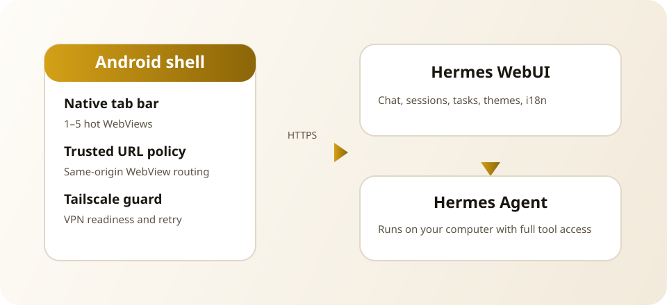
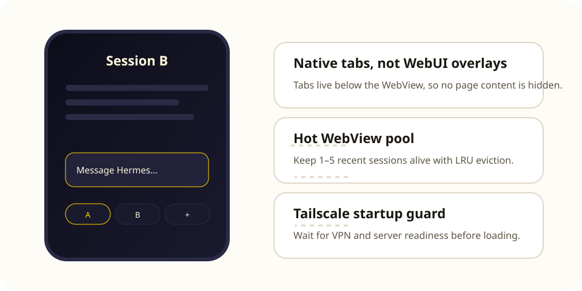

# Hermes Pocket

[](https://github.com/SayHell0W0rld/hermes-pocket/actions/workflows/ci.yml)
[](https://github.com/SayHell0W0rld/hermes-pocket/actions/workflows/release.yml)

<p align="center">
  
</p>

原生 Android 壳应用，在手机上运行 [hermes-webui](https://github.com/nesquena/hermes-webui) 聊天界面——一个围绕你自己自建 Hermes Agent 的极薄容器。

> ⚠️ **社区项目。** 与 Nous Research 无关，不受其背书或赞助。名称 "Hermes" 仅用于描述与 Hermes Agent 生态的兼容性。

## 为什么做这个

如果你在电脑上运行 [Hermes Agent](https://hermes-agent.nousresearch.com)，hermes-webui 是在浏览器里访问它的最佳方式。这个 App 把该 Web UI 包进一个极简原生壳，让它在手机上表现得像一个真正的应用：

- **全质量 Agent 访问** —— 后端运行真正的 Hermes Agent 核心（不是精简 API）。工具、记忆、技能、会话——和你在电脑 CLI 上完全一致。
- **会话延续** —— 浏览并继续你在电脑上开始的 CLI 对话。
- **无浏览器痕迹** —— 全屏体验，从 GitHub Releases 直接安装。
- **刻意保持轻量** —— 原生壳只处理网页做不到的事（配置服务器地址、接收 Intent）。所有 UI 都在 hermes-webui 里。

## 架构与壳层

Hermes Pocket 保留完整的 Hermes WebUI 体验，并在外围增加原生标签池、Tailscale 守卫和 Android 恢复路径。

<p align="center">
  
</p>

<p align="center">
  
</p>

## 架构

壳刻意**不构建自己的 UI 系统**。原生界面（设置页）继承 hermes-webui 的设计令牌，任何 Web 端 UI 改进应回馈上游 [nesquena/hermes-webui](https://github.com/nesquena/hermes-webui)。

## 环境要求

- 一个运行中的 **hermes-webui** 实例（部署见其 [README](https://github.com/nesquena/hermes-webui)），手机能通过网络访问（局域网、Tailscale、VPN 等）。
- Android 8.0+（minSdk 26）。

## 快速开始

1. **安装 App** —— 从 [Releases](https://github.com/SayHell0W0rld/hermes-pocket/releases) 下载最新 APK 并安装到手机。
2. **完成引导** —— 首次启动会进入简短引导：欢迎、服务器连接、语言/主题同步、文字大小、通知和完成页。
3. **配置服务器** —— 填写你的 hermes-webui 地址。推荐使用 HTTPS（语音输入和 PWA 功能需要安全连接），例如 `https://my-agent.example.com/webui` 或 `https://your-hostname.ts.net/webui`（Tailscale 用户）。普通 HTTP 仅建议用于 `localhost` 或受信任的内网测试。点**测试连接**，然后**保存**。
#### 为什么推荐 HTTPS

强烈建议服务器地址使用 HTTPS：

- 🎤 语音输入仅 HTTPS 可用；浏览器和 WebView 在普通 HTTP 下（`localhost` 除外）会拒绝麦克风权限。
- 🔔 部分通知和离线/PWA 能力同样只在安全上下文中开放。
- 🔒 HTTPS 全程加密连接，聊天内容和密码不会被同网络中的其他设备嗅探。
- ℹ️ Tailscale Serve 自带受信任的 Let\'s Encrypt 证书，零额外配置。

HTTP 仍是合法选项，适合受信任内网的临时测试，尤其是不需要语音输入和传输加密时。

4. **开始聊天** —— App 加载你的 hermes-webui，随时随地与你的 Hermes Agent 对话。

### 壳层能力

- **多会话标签页** —— 原生底部标签栏最多保留 5 个 Hermes 会话，不遮挡 WebUI 内容。热 WebView 数量可配置为 1 到 5，常用标签可以不重新加载直接切换。
- **字体大小** —— 在原生设置里选择 100%、110%、130% 或 150%。手势缩放保持关闭，避免误触。
- **Tailscale 启动守卫** —— 对 Tailscale 地址先等待 VPN transport 和服务器就绪，自动请求连接；必要时退回到 Tailscale/VPN 设置。

> 之后打开原生设置：长按桌面图标选择**设置**，点击启动页右上角齿轮，或在错误页点**修改服务器地址**。

## 从源码构建

```bash
./gradlew assembleDebug
```

APK 输出在 `app/build/outputs/apk/debug/app-debug.apk`。

### 前置条件

- JDK 17
- Android SDK（compileSdk 34+）
- 首次构建时 Gradle wrapper 会自动拉取依赖（需要能访问 Google Maven）。

## 发布

CI 会在每次推送到 `main` 或每个 Pull Request 上运行单元测试并构建 Debug APK。推送 `v0.1.0` 这类标签会触发自动发布流程：校验语义化版本、更新 Android 版本元数据、运行单元测试、构建可安装 APK，并上传到 GitHub Release。

签名密钥是可选的。配置后 Release 会使用正式签名；未配置时会回退为 debug 签名并输出警告。详见 [docs/RELEASE_SIGNING.md](docs/RELEASE_SIGNING.md)。

```bash
git tag v0.1.0
git push origin v0.1.0
```

## 设计与约定

原生界面使用与 Hermes WebUI 相同的深浅色令牌，并提供中文和英文界面文案。

## 安全说明

- App 仅在本地 SharedPreferences 中保存你的服务器 URL。
- 服务器地址由用户填写——只连接你信任的 hermes-webui 实例（它可以在主机上执行命令）。
- 无分析、无遥测、除你配置的服务器外不访问任何网络。

## 参与贡献

先读 [AGENTS.md](AGENTS.md)（它是人类和 AI 贡献者的开发指南）。保持壳的轻量；Web 端 UI 改进请回馈上游 hermes-webui。

## 许可证

MIT —— 见 [LICENSE](LICENSE)。第三方声明见 [THIRD_PARTY_NOTICES.md](THIRD_PARTY_NOTICES.md)。

---

[English documentation → README.md](README.md)
